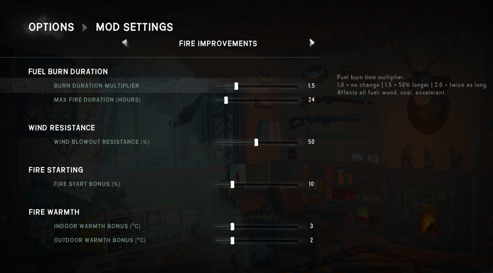

# Fire Improvements Mod

A MelonLoader mod for **The Long Dark** that makes fires more powerful and configurable.



All settings are adjustable in-game via the **Mod Settings** menu (no restart required).

## Features

| Setting | Default | Range | Description |
|---|---|---|---|
| Burn Duration Multiplier | ×1.5 | ×1.0 – ×3.0 | Multiplies how long all fuel burns (firewood, coal, cedar logs, etc.) |
| Max Fire Duration | 24 h | 0 – 200 h | Maximum possible burn time before a fire dies out (vanilla = 12 h) |
| Wind Resistance | 50 % | 0 – 100 % | Chance that wind **doesn't** extinguish the fire (100 % = wind never blows it out) |
| Fire Start Bonus | +10 % | 0 – 50 % | Flat bonus added to fire-start success probability |
| Indoor Warmth Bonus | +3 °C | 0 – 15 °C | Added to the minimum indoor air temperature provided by fire |
| Outdoor Warmth Bonus | +2 °C | 0 – 10 °C | Added to the minimum outdoor air temperature provided by fire |

## Requirements

- [The Long Dark](https://store.steampowered.com/app/305620/) (tested on v2.55)
- [MelonLoader](https://github.com/LavaGang/MelonLoader) v0.7.2+
- [ModSettings](https://github.com/STBlade/ModSettings) (installed automatically via NuGet when building from source)

## Installation

1. Download `FireImprovementsMod.dll` from the [latest release](../../releases/latest).
2. Place it in `<The Long Dark>\Mods\`.
3. Launch the game — the mod loads automatically via MelonLoader.

## Building from Source

```
dotnet build FireImprovementsMod.csproj --configuration Release
```

Requires the game path `E:\games\TheLongDark` (or edit `<GameDir>` in the `.csproj`).  
The DLL is automatically copied to `Mods\` after a successful build.

## How It Works

- **Burn duration** — patches `GearItem.Awake` to multiply `FuelSourceItem.m_BurnDurationHours` on every item instance.
- **Max fire duration** — sets `FireManager.m_MaxDurationHoursOfFire` when a playable scene loads.
- **Wind resistance** — prefix-patches `Fire.FireShouldBlowOutFromWind`, short-circuits with `false` based on a random roll.
- **Fire start bonus** — postfix-patches `FireManager.CalculateFireStartSuccess`, clamps result to [0, 1].
- **Warmth bonuses** — adds offsets to `ExperienceMode.m_MinAirTemperatureFromFireIndoors/Outdoors`.

## Languages

Fully localised in all 15 game languages: English, French, German, Spanish, Brazilian Portuguese, Polish, Czech, Russian, Turkish, Italian, Dutch, Japanese, Korean, Simplified Chinese, Traditional Chinese.

## License

MIT
